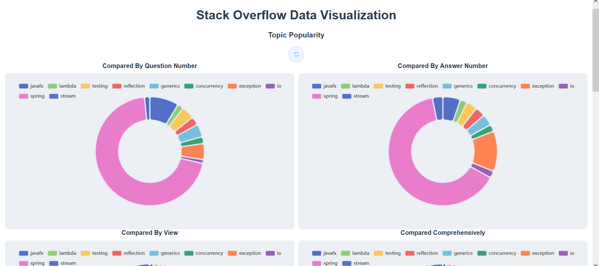
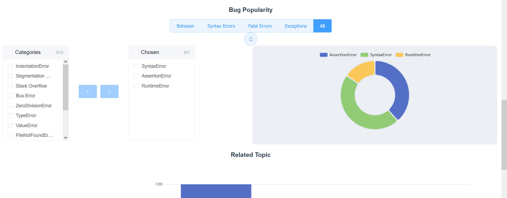
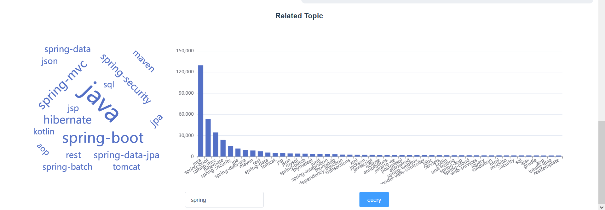

# Stack Overflow Data Visualization

## Instruction

### Setting

#### Crawler

*./src/main/java/com.example.java2_pro/crawler*

A new database in Postgresql should be built before using the crawler to fetch data from Stack Overflow. An example is like this:

| SQL_HOST  | SQL_USER | SQL_PASSWORD | SQL_DATABASE      | SQL_PORT |
| --------- | -------- | ------------ | ----------------- | -------- |
| localhost | checker  | 123456       | stackoverflow_new | 5432     |

An account of Stack Overflow is needed to get an access key, which can be done at https://stackapps.com/apps/oauth/register.

In **crawlerMain**, replace the five aforementioned parameters and the `key`. After that, you can adjust the parameters in line `dataCollector dataCollector = new dataCollector(databaseService, 100, 100, 3000,KEY);`. The three parameters stand for page size, page step, and total number that you need to collect. (Caution: If the total number is too big, the crawler part might be rearranged to switch keys to use APIs for more times)

After the setting, you can start to collect data from Stack Overflow.

#### Spring Boot Server

*./src/main/resource/application.properties*

Make sure the parameters are the same as the database you are willing to use.

### How to use

*./frontend/my-vue-app/src*

In package.json, run scripts "serve".

